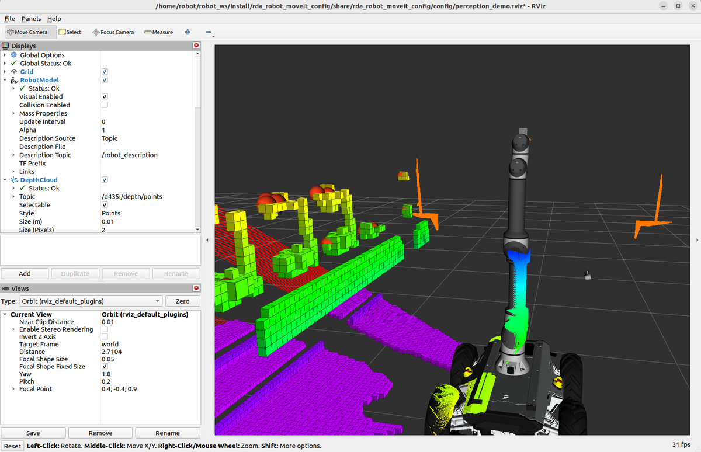
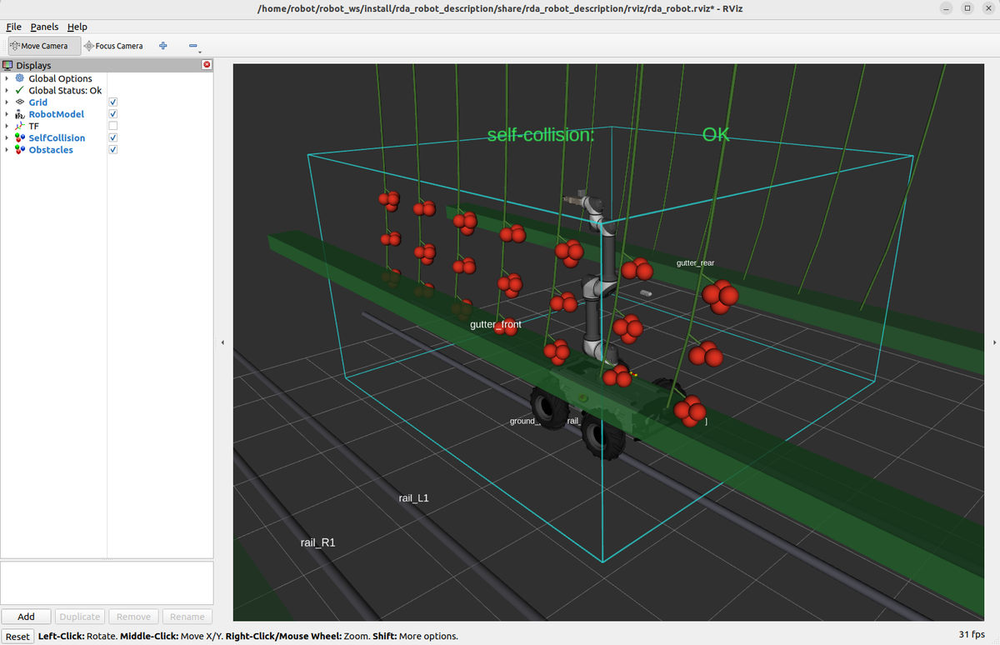
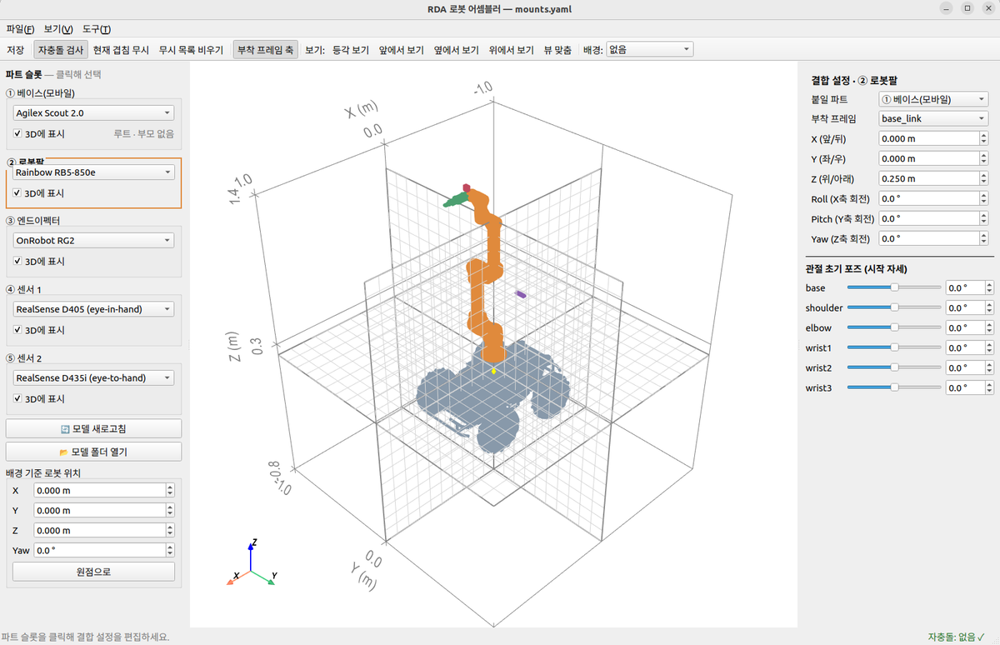
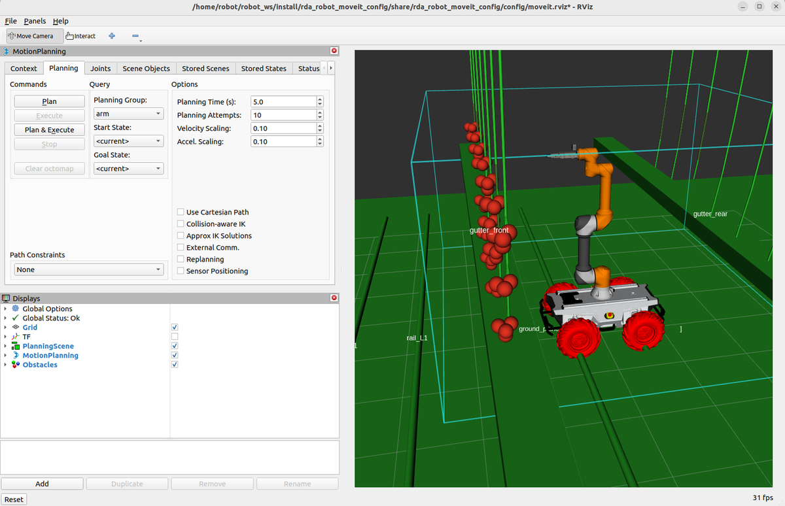
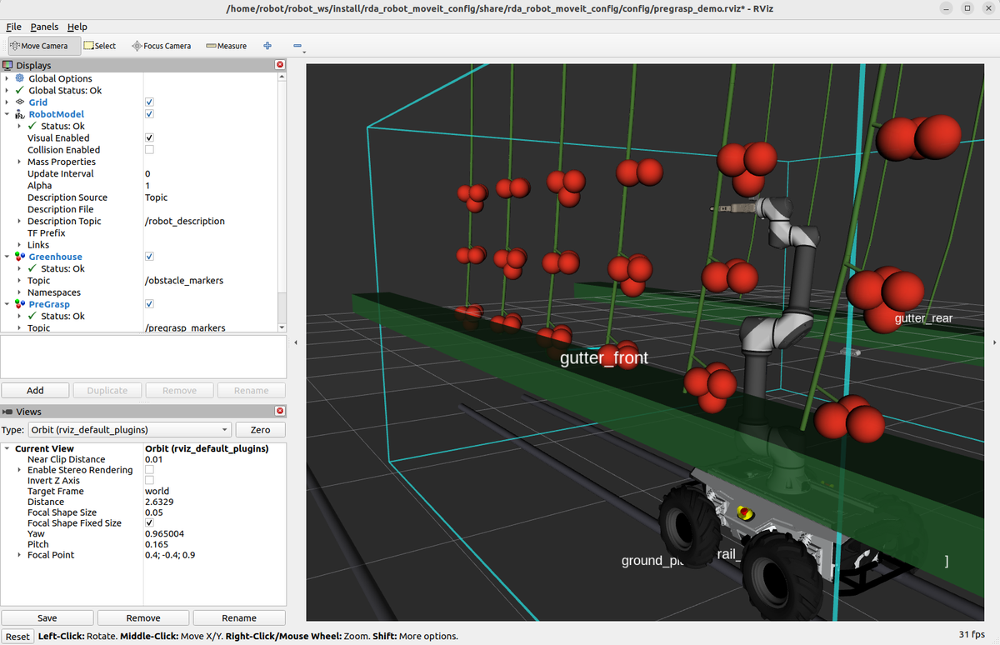
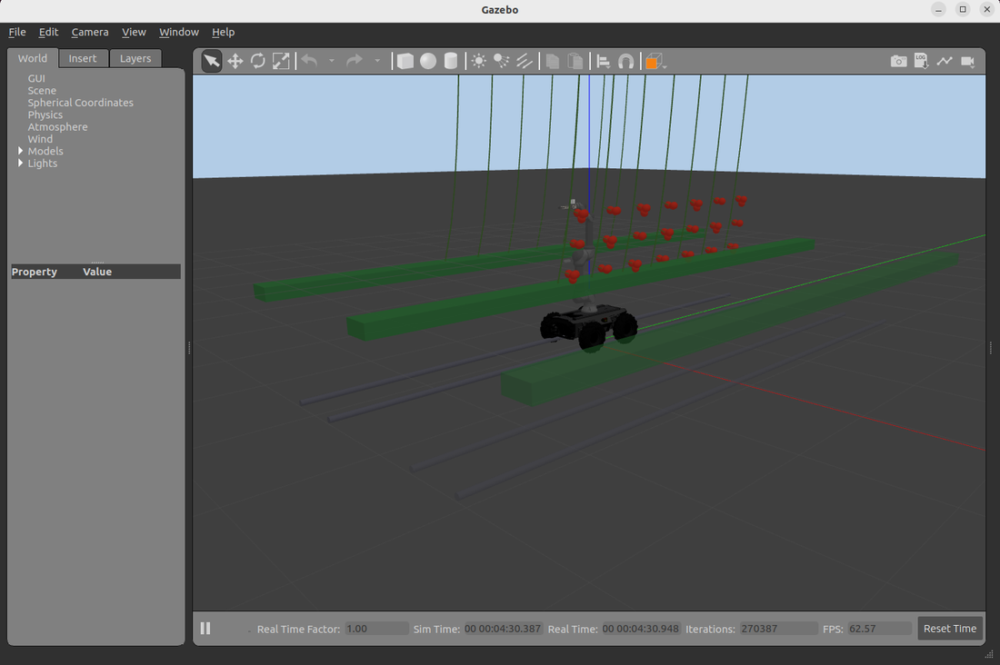
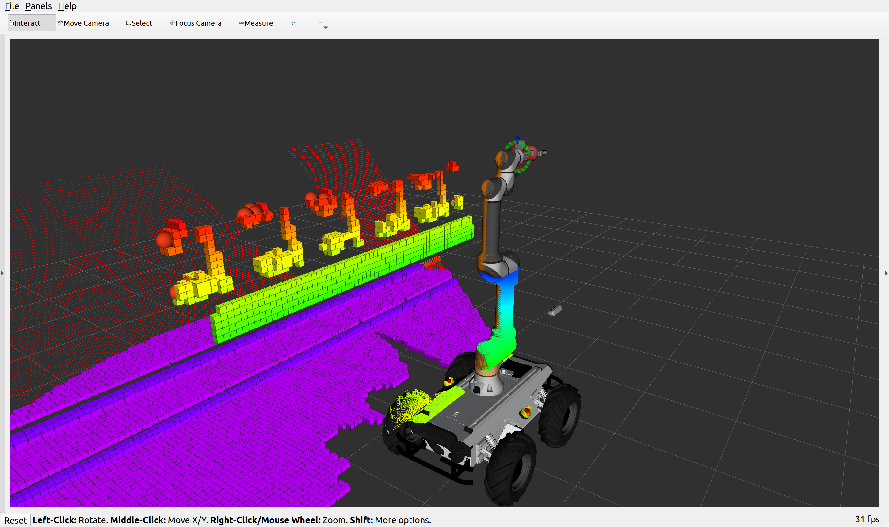
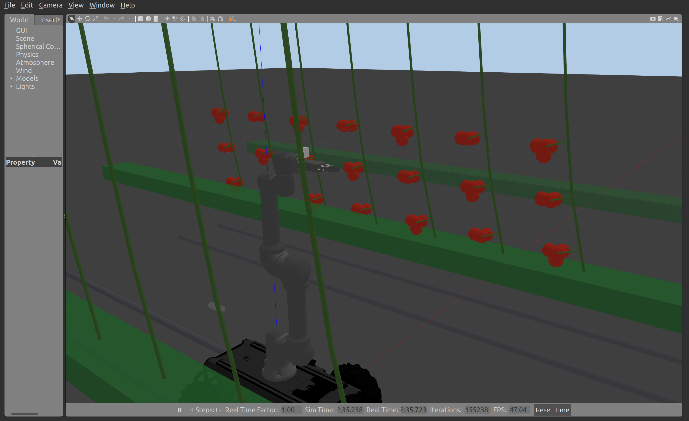
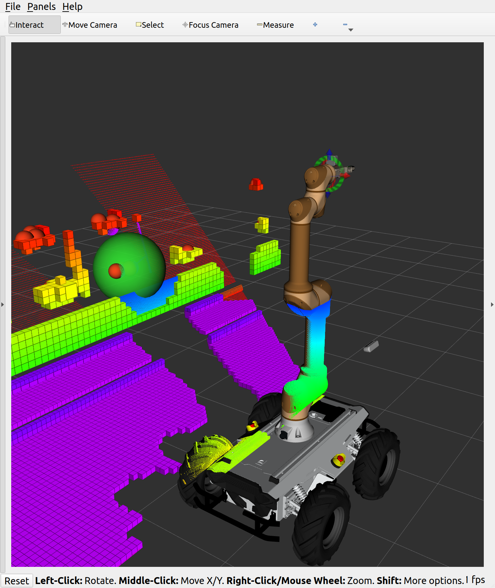
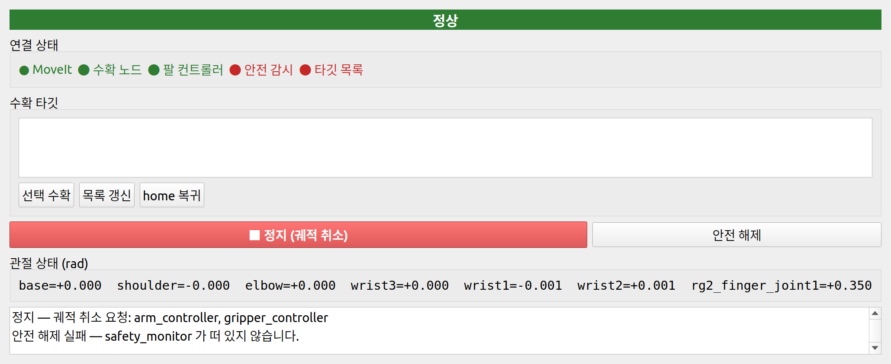

# rda_robot_ws — 농업(온실 토마토) 로봇 통합 제어 워크스페이스

ROS2 Humble 기반. **모바일 베이스 + 로봇팔 + 엔드이펙터 + 뎁스 카메라**를 하나의 로봇으로
조립하고, 온실 환경을 세우고, 카메라로 토마토를 찾아 집으러 가는 것까지 다룬다.
시뮬에서 **실제로 구동**하고(3-7), 같은 스택을 **실기 로봇 배선**으로 띄우는 것(3-8)까지 포함한다.
(한국기계연구원 교육파견 프로젝트)

이 문서는 **위에서부터 순서대로 복사·붙여넣기** 하면 그대로 돌아가도록 썼다.


*카메라가 본 것만으로 재구성한 온실 — 복셀은 충돌 장애물, 빨간 구는 인지된 토마토다(3-5).*

무엇을 실행해 볼 수 있나:

| # | 실행 | 보이는 것 |
|---|------|-----------|
| 3-1 | 통합 로봇 표시 | 조립된 로봇과 온실·작물이 RViz2 에 뜨고, 관절을 움직이면 자충돌을 빨갛게 표시 |
| 3-2 | 조립기 GUI | 베이스/팔/그리퍼/센서를 드롭다운으로 갈아끼우고 결합 위치를 마우스로 조정 |
| 3-3 | MoveIt 경로계획 | 온실 장애물을 피하는 궤적 계획 |
| 3-4 | 집기 데모 | 도달 가능한 토마토를 골라 `접근 → 파지 → 후퇴` 를 애니메이션으로 재생 |
| 3-5 | Gazebo + 센싱 | 시뮬 카메라가 본 포인트클라우드가 **그대로 충돌 장애물(옥토맵)** 이 되고, 빨간 열매를 3D 로 인지 |
| 3-6 | 인지 → 집기 | yaml 좌표가 아니라 **카메라가 찾은 열매**를 목표로 집기 |
| 3-7 | 실제 구동 + 연속 수확 | 계획을 **컨트롤러로 실행**해 Gazebo 팔이 실제로 움직이고, 딴 열매는 장면에서 사라진다 |
| 3-8 | 실기 연동(레인보우 제어박스) | 같은 스택을 **실제 로봇 배선**으로 — 하드웨어 없이도 `use_fake_hardware` 로 검증 가능 |

---

## 1. 요구 환경

- **Ubuntu 22.04** + **ROS2 Humble** (`ros-humble-desktop`)
- GPU 권장(RViz/Gazebo 렌더링). 개발 환경은 RTX 4060 / 드라이버 535 에서 검증했다.
- 디스크 약 3GB(벤더 모델 포함)

ROS2 가 아직 없다면 [공식 설치 문서](https://docs.ros.org/en/humble/Installation.html)를 먼저 따르고 오면 된다.

---

## 2. 설치 — 순서대로 복사해서 붙여넣기

### 2-1. 필요한 패키지 설치

```bash
sudo apt update
sudo apt install -y \
  python3-colcon-common-extensions python3-rosdep python3-pip git \
  ros-humble-moveit ros-humble-moveit-ros-perception \
  ros-humble-urdf-launch ros-humble-joint-state-publisher ros-humble-joint-state-publisher-gui \
  gazebo ros-humble-gazebo-ros-pkgs \
  python3-scipy python3-opencv
```

각각 왜 필요한지:

| 패키지 | 쓰이는 곳 |
|--------|-----------|
| `moveit` | 경로계획(3-3), 집기 데모(3-4) |
| `moveit-ros-perception` | **옥토맵 업데이터 플러그인** — 기본 moveit 설치엔 들어 있지 않다. 없으면 3-5 의 센싱 장애물이 아예 안 생긴다 |
| `joint-state-publisher(-gui)` | RViz 관절 슬라이더 |
| `gazebo` + `gazebo-ros-pkgs` | 시뮬레이션과 시뮬 카메라(3-5) |
| `python3-scipy`, `python3-opencv` | 열매 인지(빨강 세그멘테이션·군집화) |

### 2-2. 저장소 clone

이 저장소는 **워크스페이스의 `src` 폴더 자체**다. 그래서 `~/robot_ws/src` 로 받는다.

```bash
mkdir -p ~/robot_ws
git clone git@github.com:karevaros/rda_robot_ws.git ~/robot_ws/src
# HTTPS 를 쓴다면: git clone https://github.com/karevaros/rda_robot_ws.git ~/robot_ws/src
```

> 이 저장소는 **비공개**다. 접근 권한이 있는 계정(SSH 키 등록 또는 HTTPS 인증)으로 받아야 한다.

### 2-3. 벤더 모델 받기 (필수)

로봇 모델(Scout·RealSense·UR·xArm·Robotiq·Clearpath …)은 원저작 저장소에서 받아 쓴다.
그 폴더(`src/vendor/`)는 이 저장소에 포함돼 있지 않으니 **아래 스크립트를 반드시 한 번 돌려야
한다.** 안 돌리면 조립기 드롭다운에 이름은 보이는데 **로드가 실패**하고, 기본 로봇조차 안 뜬다.

```bash
source /opt/ros/humble/setup.bash
cd ~/robot_ws
bash src/docs/scripts/setup_vendor_models.sh     # clone + 벤더 description 패키지 빌드 (수 분)
```

이 스크립트가 받아오는 것(모두 **공개 저장소**이고 각 원저작자의 라이선스를 따른다):

| 받는 저장소 | 브랜치 | 라이선스 | 우리가 쓰는 것 |
|-------------|--------|----------|----------------|
| [agilexrobotics/scout_ros2](https://github.com/agilexrobotics/scout_ros2) | `humble` | Apache-2.0 | `scout_description` — **기본 모바일 베이스** |
| [RainbowRobotics/rbpodo_ros2](https://github.com/RainbowRobotics/rbpodo_ros2) | `main` | Apache-2.0 | `rbpodo_description` — **기본 로봇팔(RB5-850e)** |
| [IntelRealSense/realsense-ros](https://github.com/IntelRealSense/realsense-ros) | `ros2-master` | Apache-2.0 | `realsense2_description` — **기본 센서(D405/D435i)** |
| [UniversalRobots/Universal_Robots_ROS2_Description](https://github.com/UniversalRobots/Universal_Robots_ROS2_Description) | `humble` | BSD-3 | UR5e·UR10e |
| [xArm-Developer/xarm_ros2](https://github.com/xArm-Developer/xarm_ros2) | `humble` | BSD-3 | xArm6·UF850 |
| [ABC-iRobotics/onrobot-ros2](https://github.com/ABC-iRobotics/onrobot-ros2) | `main` | MIT | OnRobot RG6 |
| [PickNikRobotics/ros2_robotiq_gripper](https://github.com/PickNikRobotics/ros2_robotiq_gripper) | `humble` | BSD-3 | Robotiq 2F-85/140 |
| [frankaemika/franka_description](https://github.com/frankaemika/franka_description) | `humble` | Apache-2.0 | Franka Hand |
| [Wonikrobotics-git/allegro_hand_ros2_v5](https://github.com/Wonikrobotics-git/allegro_hand_ros2_v5) | `master-4finger` | BSD-2 | Allegro Hand V5 |
| [clearpathrobotics/clearpath_common](https://github.com/clearpathrobotics/clearpath_common) | `humble` | BSD-3 | Husky·Jackal·Ridgeback·Dingo |
| [RobotnikAutomation/robotnik_description](https://github.com/RobotnikAutomation/robotnik_description) · [robotnik_sensors](https://github.com/RobotnikAutomation/robotnik_sensors) | `humble-devel` | BSD-3 | RB-Theron·RB-Kairos·RB-Vogui·RB-Summit |
| [turtlebot/turtlebot4](https://github.com/turtlebot/turtlebot4) · [iRobotEducation/create3_sim](https://github.com/iRobotEducation/create3_sim) | `humble` | Apache-2.0 / BSD-3 | TurtleBot4 |

받은 것은 `src/vendor/` 에 그대로 두고(원본 수정 없음), 우리 저장소에는 포함하지 않는다
(`.gitignore`). 즉 **벤더 코드는 각자의 저장소에서 각자의 라이선스로 받아 쓰는 구조**다.

### 2-4. 레인보우 SDK — 실기 연동을 할 때만 (3-8)

실제 로봇(레인보우 제어박스)에 붙일 때만 필요하다. 시뮬만 쓸 거면 건너뛰어도 된다.

```bash
bash ~/robot_ws/src/docs/scripts/setup_rbpodo_sdk.sh
# /usr/local 에 설치하려면(sudo 필요):
# SYSTEM_INSTALL=1 bash ~/robot_ws/src/docs/scripts/setup_rbpodo_sdk.sh
```

레인보우 C++ SDK(`rbpodo`, Apache-2.0)를 받아 빌드하고, 그것을 필요로 하는
`rbpodo_hardware`(실기 하드웨어 인터페이스)와 `cb_safety_publisher`(안전 상태 발행)를 빌드한다.

> ⚠ SDK 는 apt 에 없다. **안 깔면 두 노드가 빌드에서 조용히 빠진다** — `colcon` 은 해당
> 패키지만 실패시키고 나머지는 성공으로 끝내므로, 실기 모드로 띄울 때 `plugin ... not found`
> 로 뒤늦게 드러난다. 스크립트가 그 경로를 고정해 준다.

### 2-5. 조립기용 파이썬 패키지

```bash
python3 -m pip install --user pyvista pyvistaqt trimesh yourdfpy pycollada python-fcl
```
조립기 GUI 의 3D 뷰와 실시간 자충돌 검사에 쓰인다(rosdep 으로는 안 깔린다).

### 2-6. 빌드

```bash
source /opt/ros/humble/setup.bash
cd ~/robot_ws
colcon build --symlink-install --packages-select \
  rda_robot_msgs rda_robot_description rda_robot_bringup \
  rda_robot_assembler rda_robot_moveit_config
```

> ⚠ **`--packages-select` 없이 그냥 `colcon build` 를 돌리지 말 것.** `src/vendor/` 의
> `xarm_sdk` 가 git submodule 을 요구해 **전체 빌드는 원래 실패**하고, 실패 하나가 의존
> 패키지 21개를 연쇄 중단시킨다(우리는 `xarm_description` 만 쓰므로 SDK 는 무관하다).
>
> ⚠ 벤더 패키지에 `--symlink-install` 을 **섞지 말 것.** 캐시가 깨져 이후 평범한 빌드까지
> 실패한다. 복구는 `rm -rf build/<패키지>` 후 재빌드.

### 2-7. 환경 소싱 — **새 터미널을 열 때마다**

```bash
source /opt/ros/humble/setup.bash
source ~/robot_ws/install/setup.bash
```

매번 치기 귀찮으면 한 번만:
```bash
echo 'source /opt/ros/humble/setup.bash' >> ~/.bashrc
echo 'source ~/robot_ws/install/setup.bash' >> ~/.bashrc
```

### 2-8. 설치 확인

```bash
source /opt/ros/humble/setup.bash && source ~/robot_ws/install/setup.bash
cd ~/robot_ws
python3 src/docs/scripts/test_models.py            # 조립기 모델 로드      → 28/28
python3 src/docs/scripts/test_integrated_urdf.py   # 통합 URDF 전 모델 조립 → 29/29
```

정상이면 이렇게 나온다:

```text
✅ sensor2      d405                         링크  1   프레임 12   anchor=base_link
로드 성공 28 / 실패 0  (총 28)

✅ 기본조합       scout_v2+rb5_850e+onrobot_rg2+d405+d435i
조립 성공 29 / 실패 0  (총 29)
```

둘 다 통과하면 설치 끝이다. 두 테스트는 **서로 다른 것을 본다** — 앞은 "조립기가 모델을 읽을
수 있나", 뒤는 "그 모델이 실제로 통합 URDF 로 조립되나". 앞만 통과하고 뒤가 조용히 실패한
적이 있어서 둘 다 돌린다.

---

## 3. 실행해 보기 — 위에서부터 순서대로

아래 블록은 각각 **새 터미널에 그대로 붙여넣으면** 돌아간다(소싱 줄 포함).
GUI 창이 뜨므로 원격 접속이라면 X 포워딩이 필요하다. 종료는 `Ctrl+C`.

### 3-1. 통합 로봇을 RViz2 에 띄우기

```bash
source /opt/ros/humble/setup.bash && source ~/robot_ws/install/setup.bash
ros2 launch rda_robot_description rda_robot_display.launch.py
```


*조립된 로봇(Scout + RB5 + RG2 + D405/D435i)과 온실·작물. 위쪽 초록 글씨 `self-collision: OK`
가 실시간 자충돌 상태다 — 팔을 접어 겹치면 그 링크가 빨갛게 덮인다.*

조립 결과(`config/mounts.yaml`)를 읽어 통합 URDF 를 만들고 RViz2 에 표시한다. 같이 뜨는 것:

| 노드 | 역할 |
|------|------|
| `robot_state_publisher` | 통합 URDF → TF |
| `joint_state_publisher_gui` | 관절 슬라이더 (시작 자세 = `mounts.yaml` 의 `initial_pose`) |
| `self_collision_monitor` | 자기 몸끼리 부딪히면 **그 링크의 실제 mesh 를 빨갛게** 덮어 표시 |
| `obstacle_publisher` | `config/obstacles.yaml` 의 온실 구조·작물 |

슬라이더로 팔을 접어 보면 자충돌 표시를 확인할 수 있다.

```bash
# 옵션
ros2 launch rda_robot_description rda_robot_display.launch.py collision:=false   # 자충돌 모니터 끄기
ros2 launch rda_robot_description rda_robot_display.launch.py obstacles:=false   # 온실/작물 끄기
```

> RViz 의 Fixed Frame 은 `world` 다. 바닥이 z=0 이고 `base_link` 는 바닥이 아니라 z=+0.235 에
> 있다(Scout 바퀴 최저점 기준). 이 값은 상수로 박은 게 아니라 URDF 에서 매번 유도한다.

### 3-2. 조립기 GUI — 파트 갈아끼우기

```bash
source /opt/ros/humble/setup.bash && source ~/robot_ws/install/setup.bash
ros2 run rda_robot_assembler assembler
```


*왼쪽 = 슬롯별 모델 선택, 가운데 = 3D 뷰(선택한 파트가 주황), 오른쪽 = 결합 위치(XYZ/RPY)와
관절 초기 포즈. 오른쪽 아래 상태줄에 자충돌 여부가 실시간으로 뜬다.*

왼쪽에서 슬롯(베이스·팔·엔드이펙터·센서1/2)별 모델을 고르고, 오른쪽에서 부착 프레임과
XYZ/RPY 를 조절하면 가운데 3D 뷰가 즉시 바뀐다. 파트끼리 겹치면 빨갛게 표시된다.
`Ctrl+S` 로 저장하면 `rda_robot_description/config/mounts.yaml` 에 기록되고,
**3-1 을 다시 실행하면 그 형상이 그대로 반영**된다(재빌드 불필요).

- 모델 라이브러리 **26종**: 베이스 12(Scout 2.0·Husky·Jackal·RB-Theron 등) · 팔 6(RB5-850e·UR5e·UR10e·UF850·xArm6·RB10-1300e) · 엔드이펙터 6(RG2·RG6·Robotiq 2F-85/140·Franka Hand·Allegro V5) · 센서 2(D405·D435i). 전부 permissive 라이선스.
- 새 모델은 `rda_robot_description/config/models/<슬롯>/` 에 파일을 떨구면 끝이다 → [`config/models/README.md`](rda_robot_description/config/models/README.md). 코드 수정도 재빌드도 필요 없다.
- 자세한 사용법 → [`rda_robot_assembler/README.md`](rda_robot_assembler/README.md)

> ⚠ **팔이나 그리퍼를 바꿨다면 SRDF 를 다시 만들어야 한다**(→ 6-2). 안 하면 MoveIt 이
> `Group state 'home' ... group 'arm' does not exist` 로 거부한다.

### 3-3. MoveIt2 — 온실 장애물을 피하는 경로계획

```bash
source /opt/ros/humble/setup.bash && source ~/robot_ws/install/setup.bash
ros2 launch rda_robot_moveit_config moveit_demo.launch.py
```


*왼쪽 MotionPlanning 패널에서 `Plan`. 이 launch 는 계획 전용이라 `Execute` 가 회색이다.*

RViz 의 **MotionPlanning** 패널에서 목표 자세를 마우스로 끌고 `Plan` 을 누르면 온실 구조와
작물을 피하는 궤적이 나온다.

> ⚠ 이 launch 는 **계획 전용**이다(`allow_trajectory_execution=false`) — `Execute` 는 회색이다.
> 실제로 실행하려면 컨트롤러가 붙은 **3-7**(Gazebo) 또는 **3-8**(실기) 로 띄운다.

### 3-4. 집기 데모 — 토마토를 골라 접근·파지·후퇴

```bash
source /opt/ros/humble/setup.bash && source ~/robot_ws/install/setup.bash
ros2 launch rda_robot_moveit_config pregrasp_demo.launch.py
```


*알고리즘이 고른 토마토로 팔이 접근하는 장면. 거터(초록)와 줄기를 피해 들어간다.*

지금 로봇 위치에서 **도달 가능한 토마토를 자동으로 골라**
`home → pre-grasp(열매를 바라보는 자세) → 접근 → 파지 → 후퇴 → home` 을 반복 재생한다.

접근 구간은 이 순서로 계획한다:

1. **직선 Cartesian** — 열매 앞이 뚫려 있으면 곧게 들어간다(접근각을 넓게 훑어 직선이
   통하는 각도를 먼저 찾는다).
2. **OMPL 우회** — 주 줄기가 막고 있으면 돌아 들어간다.
3. 목표 열매가 매달린 **화방대만** 충돌 예외로 둔다(수확 대상이라 스치는 게 정상).
   주 줄기·다른 화방대·거터는 장애물 그대로 → 진짜 회피다.

자주 쓰는 인자:

```bash
# 이 위치에서 어떤 열매가 닿는지만 보고 종료
ros2 launch rda_robot_moveit_config pregrasp_demo.launch.py scan_all:=true

# 특정 좌표를 목표로
ros2 launch rda_robot_moveit_config pregrasp_demo.launch.py use_yaml_target:=false target:="[0.86,0.18,0.98]"

# 로봇 위치를 임시로 옮겨 보기 (기본 auto = mounts.yaml 저장값)
ros2 launch rda_robot_moveit_config pregrasp_demo.launch.py base_x:=0.20

# 접근각별 직선 성공률 진단 / 헤드리스
ros2 launch rda_robot_moveit_config pregrasp_demo.launch.py diag_straight:=true
ros2 launch rda_robot_moveit_config pregrasp_demo.launch.py rviz:=false
```

> ⚠ 이 모드는 계획한 궤적을 `/joint_states` 로 흘려 **재생**만 한다. 컨트롤러로 실제 실행하려면
> **3-7** 을 본다(`execute:=true`).
> ⚠ 이 팔(reach 0.93m)로는 고설 재배 토마토 74개 중 **최전열 최하단 3~5개**만 닿는다(실측).
> 더 닿게 하려면 조립기에서 로봇을 작물 쪽으로 옮겨 저장하면 된다.

### 3-5. Gazebo 시뮬 + 센싱 — 카메라가 본 것이 장애물이 된다

여기서부터는 좌표를 손으로 적어 넣은 장애물이 아니라 **카메라가 실제로 본 것**으로 돈다.

```bash
# ⓐ 시뮬만 먼저 — 온실 월드 + 로봇 + depth 카메라
source /opt/ros/humble/setup.bash && source ~/robot_ws/install/setup.bash
ros2 launch rda_robot_description gazebo_sim.launch.py
```

```bash
# ⓑ 본편 — 시뮬 + MoveIt + 열매 인지 (RViz 에 옥토맵과 인지된 열매가 함께 보인다)
source /opt/ros/humble/setup.bash && source ~/robot_ws/install/setup.bash
ros2 launch rda_robot_moveit_config perception_demo.launch.py
```


*Gazebo 쪽 — `obstacles.yaml` 에서 생성한 온실 월드(거터·레일·줄기·토마토 186개 모델)와
그 안에 스폰된 로봇. 카메라는 이 장면을 '본다'.*


*RViz 쪽 — 같은 장면을 **카메라가 본 것만으로** 재구성한 결과. 복셀(옥토맵)이 곧 충돌
장애물이고, 빨간 구가 인지된 열매(`/detected_fruits`)다. 바닥은 보라, 거터는 초록, 작물은
노랑~주황으로 높이에 따라 색이 다르다. 손으로 넣은 장애물은 하나도 없다.*

돌아가는 구조:

- D435i(전역, 베이스 부착)와 D405(손끝, 그리퍼 부착)가 포인트클라우드를 낸다.
- MoveIt 의 `PointCloudOctomapUpdater` 2개가 그 클라우드를 받아 **하나의 옥토맵**을 만든다
  → 그게 곧 충돌 장애물이다. `obstacles.yaml` 로 넣은 명명 객체가 **하나도 없는 상태에서도**
  계획이 막힌다(= 센싱만으로 장애물이 성립).
- `fruit_detector` 가 클라우드의 빨간 영역을 3D 구로 만들어 `/detected_fruits` 로 낸다.

| 토픽 | 내용 |
|------|------|
| `/d435i/depth/points`, `/d405/depth/points` | 포인트클라우드(각 640×480) |
| `/d435i/depth/image_raw`, `/d405/depth/image_raw` | 컬러 이미지(클라우드와 픽셀 1:1 정렬) |
| `/monitored_planning_scene` | 옥토맵이 실린 planning scene |
| `/detected_fruits` | 인지된 열매(MarkerArray — 중심·지름, world 좌표) |

확인 명령(다른 터미널에서):

```bash
source /opt/ros/humble/setup.bash && source ~/robot_ws/install/setup.bash
ros2 topic hz /d435i/depth/points                                                  # 센서 입력
ros2 topic echo /monitored_planning_scene --once --field world.octomap.octomap.id   # 'OcTree' 면 옥토맵 생성됨
ros2 topic echo /detected_fruits --once | head -40                                  # 인지된 열매
```

옵션:

```bash
ros2 launch rda_robot_moveit_config perception_demo.launch.py gui:=false         # Gazebo 창 끄기
ros2 launch rda_robot_moveit_config perception_demo.launch.py rviz:=false        # 헤드리스
ros2 launch rda_robot_moveit_config perception_demo.launch.py detect:=false      # 열매 인지 끄기
ros2 launch rda_robot_moveit_config perception_demo.launch.py obstacles:=true    # 설계값 장애물도 함께(비교용)
ros2 launch rda_robot_moveit_config perception_demo.launch.py octomap_resolution:=0.02  # 복셀 더 잘게
ros2 launch rda_robot_description gazebo_sim.launch.py world:=empty               # 빈 월드
```

**열매 인지 정확도(실측, Gazebo 온실):** 중심오차 중앙값 **1.6cm** · 반경오차 **+0.1cm**(정답
3.5cm) · 센서에 실제로 보이는 열매 기준 재현율 **92%**(25개 중 23개). 전체 74개 중 나머지는
고정된 한 시점에서 가려지거나 화각 밖이다.

> 한 화방의 열매는 중심간격 6cm 인데 반경이 3.5cm — **서로 파고들어 한 덩어리로 보인다.**
> 덩어리 무게중심을 집으면 3cm 어긋나 파지에 실패하므로, 반경 사전지식 RANSAC + 반경고정
> 최소제곱으로 열매를 하나씩 분리한다.

> ⚠ 종료 후 남은 프로세스가 있으면 `ros2 launch` **부모 PID** 를 kill 할 것. `gzserver` 만
> 죽이면 `robot_state_publisher` 가 살아남아 옛 URDF 를 계속 발행하고, 다음 실행이 엉뚱한
> 로봇을 스폰한다.
> ⚠ 지금 로봇은 Gazebo 에서 `static` 이라 **팔이 물리적으로 움직이지 않는다**(손끝 카메라
> 시점 고정). 그래서 3-4 집기 데모와 이 시뮬을 **동시에 돌리면 안 된다** — TF 상으로만 팔이
> 움직여 클라우드가 엉뚱한 자세로 투영되고 옥토맵이 오염된다. 실제 관절 구동은 6주차.

### 3-6. 인지 결과로 집기 — 센싱과 계획을 잇기

3-5 ⓑ 를 띄워 둔 상태에서, 다른 터미널에:

```bash
source /opt/ros/humble/setup.bash && source ~/robot_ws/install/setup.bash
ros2 launch rda_robot_moveit_config pregrasp_demo.launch.py target_source:=perception
```

`obstacles.yaml` 의 이름표(`fruit_r0_p3_t0_f2`)가 아니라 **카메라가 찾은 열매**(`det_13` …)를
목표로 삼는다. 실환경에는 이름표가 없으니 이쪽이 최종 형태다.



빨간 구슬이 인지 결과(`/detected_fruits`), 색 상자가 두 카메라(D435i·eye-in-hand D405)가
누적한 옥토맵이다. **이름표는 하나도 쓰지 않았다** — 저 장면만으로 계획이 선다.

```bash
# 인지된 열매 중 어떤 게 닿는지만 확인
ros2 launch rda_robot_moveit_config pregrasp_demo.launch.py target_source:=perception scan_all:=true
```

실제 출력(이름표가 `fruit_r0_p3_t0_f0` 가 아니라 인지 번호 `det_13` 인 점에 주목):

```text
인지 열매 19개 수신 (0.0s)
=== 도달 스캔 시작: 전체 19개 열매 (base link0 xy=[0. 0.]) ===
  [O] det_13   (+0.83,+0.13,0.98) link0거리 1.053m  φ=-40°
  [O] det_17   (+0.84,-0.28,0.97) link0거리 1.079m  φ=-40°
  [O] det_14   (+0.86,+0.19,0.98) link0거리 1.083m  φ=+0°
  [O] det_18   (+0.86,-0.22,0.97) link0거리 1.085m  φ=+0°
  [O] det_15   (+0.90,+0.12,0.96) link0거리 1.099m  φ=-20°
=== 도달 가능 5/19개 ===
    수확 대상 후보: det_13, det_17, det_14, det_18, det_15
```

그중 하나를 실제로 집으러 가는 한 사이클:

```text
목표 = det_13 @ (0.83,0.13,0.98) r=0.037 · pre-grasp φ=-40° θ=+0° (standoff 12cm)
직선접근 각도 채택: φ=-30° θ=+0° → 직선 Cartesian fraction=1.00(집기 전 곧게 접근)
① home→pre-grasp 계획 16점
② 접근=직선 Cartesian 8점(fraction=1.00) — 주 줄기 등 경로상 장애물 없음
[det_13] 데모 1회 완료(재생).
```

> `det_13` 의 좌표 (0.83, 0.13, 0.98) 은 설계값 `fruit_r0_p3_t0_f0` (0.83, 0.133, 0.983) 과
> **0.7cm** 차이다 — 카메라만으로 찾은 위치로 집으러 갔다는 뜻이다.

> ⚠ 이 모드는 재생만 하므로 시뮬 카메라 시점이 고정이다. 팔이 실제로 돌며 손끝 카메라가
> 장면을 갱신하는 것은 **3-7**(`execute:=true`) 부터다.

### 3-7. 실제로 구동하기 — 계획을 컨트롤러로 실행하고 연속 수확

여기서부터는 **재생이 아니라 실제 구동**이다. Gazebo 로봇에 `ros2_control` 을 붙여
MoveIt `execute` 로 궤적을 흘리고, 수확한 열매는 장면에서 지운다.

```bash
source /opt/ros/humble/setup.bash && source ~/robot_ws/install/setup.bash
ros2 launch rda_robot_moveit_config perception_demo.launch.py \
  execute:=true run_demo:=true harvest_all:=true harvest_max:=5 harvest_remove:=true \
  gui:=true rviz:=true sensors:=d435i world:=greenhouse detect:=true
```

`home → pre-grasp → 직선 접근 → 파지 → 후퇴` 를 컨트롤러로 실행한다. 한 개를 따면
**목록을 다시 뽑아** 다음 열매로 넘어간다(딴 열매는 재인지 대상에서 사라진다).



같은 순간의 RViz. **초록 구**가 목표 열매 주변의 ACM 허용 영역(ρ)이고, 그 안쪽 옥토맵
복셀이 지워져 있다 — 이름표 없는 센싱 장면에서 "이 열매만 만져도 된다"를 공간으로 표현한 것이다.
빨간 구슬은 인지된 열매(`/detected_fruits`), 색 상자는 두 카메라가 만든 옥토맵이다.



```bash
# 접근 전략 비교 — harvest_linear(기본) vs direct
… strategy:=direct

# 손으로 조작 — GUI 패널(권장) 또는 터미널 조작기
#   패널은 연결 상태·안전 상태·타깃·관절을 함께 보여주고 '정지' 버튼이 있다.
#   (어셈블러 GUI 의 "🍅 수확 패널 열기" 버튼으로도 열린다)
ros2 run rda_robot_bringup harvest_panel.py
ros2 run rda_robot_bringup harvest_operator.py
```



> 위 화면의 `안전 감시`·`타깃 목록`이 빨간 것은 정상이다 — 안전 감시(`safety_monitor`)는
> 실기용이라 시뮬 기본 구성에서 안 뜨고, 타깃 목록은 수확 노드가 발행할 때만 채워진다.

```bash

# 판정이 흔들리는지 진단 / 수확 전후 추적
… reach_repeat:=5
… probe_after_harvest:=5 screen_why_detail:=true
```

> ⚠ **`sensors:=d435i` 로만** 쓴다 — 센서를 2개 켜면 MoveIt 의 shape_mask 가 깨진다.
> ⚠ 이 모드는 로봇 링크의 **중력·충돌을 끈다**(kinematic 이동만 쓰므로). 물리 파지는 범위 밖.

### 3-8. 실기 연동 — 레인보우 제어박스에 붙이기

같은 스택을 실제 로봇 배선으로 띄운다. **하드웨어가 없어도 배선 검증은 된다.**

```bash
source /opt/ros/humble/setup.bash && source ~/robot_ws/install/setup.bash

# ⓐ 하드웨어 없이 배선만 검증 (제어박스 불필요)
ros2 launch rda_robot_description real_robot.launch.py use_fake_hardware:=true \
  gripper_dry_run:=true

# ⓑ 제어박스에 접속 — 팔은 움직이지 않음(제어박스 Simulation 모드)
ros2 launch rda_robot_description real_robot.launch.py robot_ip:=10.0.2.7 cb_simulation:=true

# ⓒ 실제 구동 🔴
ros2 launch rda_robot_description real_robot.launch.py robot_ip:=10.0.2.7 cb_simulation:=false \
  safety:=true
```

ⓐ 로 확인되는 것: 컨트롤러 2종 활성 · `/joint_states` 8관절(팔6+손가락2) · 손가락 TF ·
`FollowJointTrajectory` 액션 왕복. **MoveIt `execute` 가 쓰는 경로 전체**다.

```bash
# 궤적을 직접 하나 보내 보기
ros2 action send_goal /arm_controller/follow_joint_trajectory \
  control_msgs/action/FollowJointTrajectory \
  "{trajectory: {joint_names: [base, shoulder, elbow, wrist1, wrist2, wrist3],
                 points: [{positions: [0.0, -0.5, 0.0, 0.0, 0.0, 0.0],
                           time_from_start: {sec: 3}}]}}"
```

**선행 조건**: 레인보우 SDK 를 깔아야 `rbpodo_hardware` 가 빌드된다 → **2-4** 참조.

> 🔴 **`cb_simulation:=true` 는 오프라인 모드가 아니다.** 제어박스에 **실제로 접속**하고
> 제어박스의 동작 모드만 Simulation 이다. 하드웨어 없는 검증은 `use_fake_hardware:=true` 다.
> 제어박스가 없는데 실기 모드로 띄우면 하드웨어 인터페이스가 조용히 무한 대기하므로,
> launch 가 **먼저 TCP 5000/5001 을 확인해 3초 만에 원인을 알리고 멈춘다**(`preflight:=false` 로 끌 수 있다).

> 🔴 **그리퍼 명령은 아직 미확정이다.** 실기 RG2 는 제어박스 스크립트(`gripper_macro`)로
> 움직이는데, 레인보우 UI Script 문서에 OnRobot 항목이 없다(SDK enum 에는 `OnRobot_RG2=12` 가
> 있다). 그래서 명령 문자열을 **파라미터로 빼 두었다** — 티치펜던트에서 쓰는 실제 문자열을
> `cmd_move` 에 넣으면 코드 변경 없이 동작한다.

> ⚠ **실행 감시(`safety:=true`)는 기본 꺼짐이다.** 제어박스 충돌·E-stop 을 읽는 노드가
> 데이터 채널에 **두 번째 연결**을 여는데, 다중 접속 허용 여부를 확인하지 못했다. 실기 첫
> 연결에서 ①단독 ②동시 순으로 확인한 뒤 켜는 것을 권한다. 꺼진 채 뜨면 launch 가 경고한다.

### 3-9. 가상환경 3종으로 내보내기 — Gazebo · Isaac Sim · Unity

**같은 통합 URDF 하나**에서 세 시뮬레이터용 산출물을 만든다. 세 번들의 `rda_robot.urdf` 는
**바이트 동일**하다(md5 대조) — 형상이 갈릴 여지가 없다는 뜻이다.

```bash
source /opt/ros/humble/setup.bash && source ~/robot_ws/install/setup.bash
cd ~/robot_ws

# ⓐ Gazebo — 온실 월드(SDF, static 186개) + 통합 URDF
mkdir -p export/gazebo
ros2 run rda_robot_bringup gen_gazebo_world.py    > export/gazebo/greenhouse.world
ros2 run rda_robot_assembler compose_urdf -o export/gazebo/rda_robot.urdf

# ⓑ Isaac Sim — Isaac 없이 Pixar USD 로 직접 쓴다 (pip usd-core)
ros2 run rda_robot_bringup gen_usd_scene.py --out export/isaac

# ⓒ Unity — 열기만 하면 되는 프로젝트 통째로
ros2 run rda_robot_bringup gen_unity_assets.py --out export/unity
```

**검증 — 시뮬레이터 없이도 대부분 돌아간다.**

```bash
python3 src/docs/scripts/test_usd_export.py                              # 23/23 (Isaac 불필요)
python3 src/docs/scripts/test_unity_export.py --project export/unity     # 14/14 (Unity 불필요)
```

Unity 를 설치했다면 배치모드로 열어 **형상까지** 대조한다(14/14 → **20/20**).

```bash
UNITY=~/unity/Editor/Unity
$UNITY -batchmode -nographics -quit -projectPath $PWD/export/unity \
  -executeMethod RdaBatch.RunAll -logFile /tmp/unity_batch.log
python3 src/docs/scripts/test_unity_export.py --project export/unity     # 20/20
```

**ROS 연동(미러) · 물리 거동 시험** — 플레이어를 빌드해 두면 사람이 Play 를 누르지 않아도 검증된다.

```bash
# 미러 — 살아 있는 /joint_states 를 Unity 가 같은 자세로 그린다
bash src/docs/scripts/setup_ros_tcp_endpoint.sh          # 최초 1회(upstream 버그 패치 포함)
$UNITY -batchmode -nographics -quit -projectPath $PWD/export/unity -executeMethod RdaBatch.BuildScene
$UNITY -batchmode -nographics -quit -projectPath $PWD/export/unity -executeMethod RdaBatch.BuildPlayer
python3 src/docs/scripts/test_unity_ros_bridge.py                        # 7/7

# 물리 — 중력에서 팔이 버티는가 (유도 effort 값 시험)
$UNITY -batchmode -nographics -quit -projectPath $PWD/export/unity -executeMethod RdaBatch.BuildPhysicsScene
$UNITY -batchmode -nographics -quit -projectPath $PWD/export/unity -executeMethod RdaBatch.BuildPhysicsPlayer
python3 src/docs/scripts/test_unity_physics.py --project export/unity    # 8/8
```

> 🔴 **세 환경의 검증 등급이 다르다 — 같은 것으로 읽으면 안 된다.**
> **Gazebo** = 실행·수확 실증(제어가 실제로 도는 유일한 환경) ·
> **Unity** = 실행 검증(형상·장면 20/20) + ROS 재현(7/7) + 중력 거동(8/8) ·
> **Isaac** = 산출물 + 로컬 수치 검증 23/23, **실행은 프로젝트 범위 밖**(2026-08-16 결정).

> 🔴 **로컬 검증 통과가 실행 보증이 아니다.** Unity 는 로컬 14/14 를 통과한 상태에서 실제로
> 열어 보니 결함 2건이 나왔고(패키지 모듈 누락 · 리플렉션 인자·코루틴), 화면을 보고서야
> 온실 원기둥 109개가 누워 있고 로봇이 90° 돌아간 것을 사람이 찾았다. **개수 검사는 형상
> 검사가 아니다.** 같은 이유로 **Isaac 의 23/23 도 "실행하면 문제없다"는 뜻이 아니다.**

> ⚠ **생성기 재실행은 Unity 프로젝트를 비운다**(`Library` 캐시만 남는다). 씬·플레이어·리포트가
> 전부 사라지므로 순서는 **생성 → PhysicsScene→PhysicsPlayer → Scene→Player → RunAll** 이다.
> 정적 검증이 갑자기 14/14 로 보이면 `RdaBatch.RunAll` 을 다시 돌리면 된다.

> ⚠ **물리 시험이 보증하는 범위** — 중력에서의 팔 거동만이다. 로봇 콜라이더를 끈 채 재므로
> **접촉·충돌 응답은 미검증**이고, 드라이브 게인은 플레이스홀더이며, **PhysX 안의 값이지 실기
> 정확도가 아니다**.

---

---

## 4. 프로젝트 구조

| 패키지 | 내용 |
|--------|------|
| `rda_robot_description` | 모델 라이브러리(`config/models/`), mesh, 결합설정(`config/mounts.yaml`), 온실·작물 정의(`config/obstacles.yaml`), 컨트롤러 설정(`config/controllers*.yaml`), 관절 토크(`config/joint_effort.yaml`), 표시·Gazebo·**실기** launch |
| `rda_robot_assembler` | 조립 GUI + **통합 URDF 컴포저**(`compose_urdf`) + `mesh2urdf` |
| `rda_robot_bringup` | 자충돌 모니터, 장애물 발행, 집기 데모, Gazebo 월드 생성, **열매 인지**(`fruit_detector.py`), 수확 조작기·**GUI 실행 패널**(`harvest_panel.py`), **그리퍼 어댑터·안전 감시**(실기), **3종 내보내기**(`gen_usd_scene.py`·`gen_unity_assets.py`) |
| `rda_robot_moveit_config` | MoveIt2 설정(SRDF/ACM/OMPL/3D센서) + `moveit_demo`·`pregrasp_demo`·`perception_demo` launch |
| `rda_robot_msgs` | 메시지 정의 — `SafetyState`(제어박스 안전 상태) |

데이터 흐름:

```
조립기 GUI ──저장──▶ config/mounts.yaml ──┐
                                          │  같은 모델 정의를 공유
config/models/<슬롯>/*.yaml ──────────────┤  → 앱 화면과 RViz/Gazebo 형상이 일치
                                          ▼
                            compose_urdf (Python 컴포저)
                                          │
     ┌────────────┬────────────┬─────┴──────┬─────────────┬────────────┐
     ▼            ▼            ▼            ▼             ▼            ▼
rda_robot_    moveit_      pregrasp_    perception_   perception_   real_robot
 display       demo          demo          demo      demo+execute
(3-1 표시)  (3-3 계획)    (3-4 집기)   (3-5 센싱)    (3-7 구동)    (3-8 실기)
                                          │
                              같은 URDF 에서 3종 내보내기 (3-9)
     ┌────────────────────────┬───────────┴────────────┐
     ▼                        ▼                        ▼
gen_gazebo_world.py      gen_usd_scene.py       gen_unity_assets.py
export/gazebo/           export/isaac/          export/unity/
 (월드 SDF + URDF)        (USD 번들 16MB)        (Unity 프로젝트)
     └──────────── rda_robot.urdf 는 3종 모두 바이트 동일 ────────────┘
```

시뮬과 실기는 **같은 통합 URDF** 를 쓴다. 차이는 URDF 안의 `ros2_control` 블록 하나뿐이다 —
`gazebo_sim` 은 벤더 블록을 **GazeboSystem 으로 교체**하고, `real_robot` 은 그 블록을
**그대로 보존**한다(즉 실기 경로는 처음부터 통합 URDF 안에 있었다).

온실 구조와 작물은 `rda_robot_description/config/obstacles.yaml` **하나가 단일 진실원**이다.
RViz/MoveIt 의 planning scene(`obstacle_publisher.py`)과 Gazebo 월드(`gen_gazebo_world.py`)가
같은 파일에서 나오므로 두 화면의 좌표가 어긋나지 않는다.

**기본 파트 모델**

| 파트 | 모델 | 출처 | 라이선스 | 어디에 있나 |
|------|------|------|----------|-------------|
| 모바일 | Agilex Scout 2.0 | [agilexrobotics/scout_ros2](https://github.com/agilexrobotics/scout_ros2) | Apache-2.0 | `src/vendor/` (2-3 에서 clone) |
| 로봇팔 | Rainbow RB5-850e | [RainbowRobotics/rbpodo_ros2](https://github.com/RainbowRobotics/rbpodo_ros2) | Apache-2.0 | `src/vendor/` (2-3 에서 clone) |
| 엔드이펙터 | OnRobot RG2 | [AndrejOrsula/ur5_rg2_ign](https://github.com/AndrejOrsula/ur5_rg2_ign) 에서 추출·편입 | BSD | **이 저장소 안**(`rda_robot_description`) |
| 센서 | RealSense D405(손끝) + D435i(전역) | [IntelRealSense/realsense-ros](https://github.com/IntelRealSense/realsense-ros) | Apache-2.0 | `src/vendor/` (2-3 에서 clone) |

나머지 22종의 출처·라이선스는 [2-3 표](#2-3-벤더-모델-받기-필수)와
[`config/models/README.md`](rda_robot_description/config/models/README.md) 에 있다.

파트 규약 비교 → [`docs/파트규약-비교.md`](docs/파트규약-비교.md) ·
기구학 분석 → [`docs/기구학-분석.md`](docs/기구학-분석.md)

---

## 5. 온실·작물 바꾸기

`rda_robot_description/config/obstacles.yaml` 하나만 고치면 RViz 와 Gazebo 양쪽에 반영된다.
실제 구조는 이렇게 생겼다(템플릿 + 배치를 코드가 펼친다 — 열매를 손으로 나열하지 않는다):

```yaml
crops:
  template:
    stem:  {radius: 0.006, height: 2.2}      # 줄기
    truss:                                   # 화방(열매 뭉치)
      first_z: 0.10                          # 첫 화방 높이
      spacing: 0.25                          # 화방 수직간격
      count: 3                               # 주당 화방 수
      fruits_per_truss: 4
      fruit_radius: 0.035                    # 대과 토마토 Ø70mm
  span: {y_min: -1.2, y_max: 1.2, spacing: 0.4}   # 줄 길이와 주간 간격
  rows:
    - {x: 0.83,  gutter_top: 0.92}                       # 앞줄: 줄기 + 열매
    - {x: -0.83, gutter_top: 0.92, fruits_per_truss: 0}  # 뒷줄: 줄기만
```

수치를 슬라이더로 만지며 맞추고 싶다면:

```bash
source /opt/ros/humble/setup.bash && source ~/robot_ws/install/setup.bash
ros2 run rda_robot_bringup crop_tuner.py
```

---

## 6. 개발자 참고

### 6-1. 통합 URDF 만들어 검사하기

```bash
source /opt/ros/humble/setup.bash && source ~/robot_ws/install/setup.bash
DESC=~/robot_ws/src/rda_robot_description
ros2 run rda_robot_assembler compose_urdf --mounts $DESC/config/mounts.yaml -o /tmp/rda_robot.urdf
check_urdf /tmp/rda_robot.urdf
```

### 6-2. 팔/그리퍼를 바꿨을 때 — SRDF 재생성 (필수)

SRDF/ACM 은 링크 이름과 형상에 묶여 있어 자동으로 따라오지 않는다.

```bash
cd ~/robot_ws
python3 src/docs/scripts/gen_srdf.py /tmp/rda_robot.urdf \
        src/rda_robot_moveit_config/config/rda_robot.srdf 5000
```

> 벤더가 준 SRDF(`rbpodo.srdf`)는 쓰지 말 것 — `Never`(절대 충돌 안 함)로 적힌 6쌍 중 4쌍이
> 실제로는 충돌한다(`docs/기구학-분석.md` 6장). 우리 SRDF 는 URDF 에서 직접 생성한다.

**관절 토크 표도 같이 다시 만든다.** `config/joint_effort.yaml` 은 특정 팔에서 유도한 값이라,
팔이 바뀌면 컴포저가 **적용하지 않고 그 사실을 알린다**(`model:` 필드로 판별).

```bash
python3 src/docs/scripts/joint_effort_derive.py /tmp/rda_robot.urdf \
        --payload <그 팔의 정격 kg> --prefix <슬롯 접두사> \
        --yaml src/rda_robot_description/config/joint_effort.yaml
# 생성된 yaml 에 model: <그 팔의 모델 id> 를 적어 준다
```

### 6-3. 회귀 테스트

```bash
cd ~/robot_ws
python3 src/docs/scripts/test_models.py            # 조립기 모델 로드      → 28/28
python3 src/docs/scripts/test_integrated_urdf.py   # 통합 URDF 전 모델 조립 → 29/29
```

### 6-4. 다시 빌드 / 커밋

```bash
# 고친 패키지만
cd ~/robot_ws && colcon build --symlink-install --packages-select rda_robot_description

# 우리 패키지 전체
cd ~/robot_ws && colcon build --symlink-install --packages-select \
    rda_robot_msgs rda_robot_description rda_robot_bringup \
    rda_robot_assembler rda_robot_moveit_config

cd ~/robot_ws/src && git add -A && git commit -m "메시지" && git push origin main
```

> launch 는 설치된 share 를 읽으므로 `rda_robot_description` 은 반드시 `--symlink-install`
> 로 빌드할 것. 안 그러면 소스를 고쳐도 반영되지 않는다.

---

## 7. 문제가 생기면

| 증상 | 원인·해결 |
|------|-----------|
| 조립기 드롭다운에 모델은 보이는데 **로드 실패** | `src/vendor/` 가 없다 → **2-3** 실행 |
| `colcon build` 가 21개 패키지에서 연쇄 실패 | 인자 없이 전체를 빌드했다 → `--packages-select` 로 우리 패키지만(**2-6**) |
| 벤더를 빌드한 뒤 평범한 빌드까지 실패 | 벤더에 `--symlink-install` 을 섞었다 → `rm -rf build/<패키지>` 후 재빌드 |
| 소스를 고쳤는데 launch 에 반영이 안 됨 | `--symlink-install` 없이 빌드했다 → **6-4** |
| MoveIt 이 `group 'arm' does not exist` | 팔/그리퍼를 바꾸고 SRDF 를 안 만들었다 → **6-2** |
| `moveit_demo` 에서 `Execute` 가 회색 | 그 launch 는 계획 전용이다 → 실행은 **3-7**(Gazebo) 또는 **3-8**(실기) |
| 실기 모드가 `Connecting to robot at ...` 에서 멈춘 채 아무 말이 없음 | 제어박스에 접속이 안 되는 것이다(에러도 타임아웃도 안 난다) → launch 의 사전 점검이 3초 만에 알려 준다. 하드웨어 없이 볼 거면 `use_fake_hardware:=true` |
| 실기 모드에서 컨트롤러가 활성화되지 않음(`State interface ... not found`) | 시뮬용 `controllers.yaml` 을 쓴 것이다. 벤더 하드웨어는 `velocity` **상태**를 주지 않는다 → `controllers_real.yaml` |
| `plugin rbpodo_hardware/RBPodoHardwareInterface not found` | 레인보우 SDK 가 없어 그 패키지가 빌드에서 빠졌다 → **2-4** |
| 새로 만든 파이썬 노드를 `ros2 run` 이 못 찾음 | `--symlink-install` 은 원본 파일 권한을 그대로 쓴다 → 소스에 `chmod +x` |
| Gazebo 를 다시 켰더니 **엉뚱한 로봇**이 뜸 | 이전 `robot_state_publisher` 가 살아 옛 URDF 를 발행 중 → `ros2 launch` 부모 PID 를 kill |
| 옥토맵이 계속 **비어 있음** | 노드의 `use_sim_time` 이 빠졌다 → TF 시각 불일치로 클라우드가 통째로 버려진다 |
| 열매가 **하나도 검출되지 않음**(에러도 없음) | 클라우드 `rgb` 바이트 순서 문제. Gazebo 는 PCL 관례의 역순이라 기본값이 `bgr` 이다. 실기 카메라라면 `-p rgb_order:=rgb` |
| 인지는 되는데 **집으러 가지 않음** | 그 열매가 팔 도달권 밖일 수 있다 → `scan_all:=true` 로 도달 목록 확인 |

알아두면 좋은 것:

- **링크 이름 계약**: 내장 Scout/RB5/RG2 는 `base_link`·`link0`~`link6`·`tcp`·`rg2_hand` 를
  그대로 쓴다(`gen_srdf`·kinematics·MoveIt 이 의존). 그 외 모델은 슬롯 접두사가 붙는다
  (`arm_base_link`·`sensor1_camera_link` …) — 모델끼리 `base_link` 이름이 겹치기 때문이다.
- **결합값(mount)은 아직 추정치다.** 도면·실측을 반영하기 전까지 통합 로봇의 형상은 확정이
  아니고, 그 위에서 잰 도달권·경로 수치도 잠정값이다.
- **관절 토크(effort)는 유도값이다.** 벤더 URDF 는 6축 전부 10 Nm(자기 팔도 못 드는
  플레이스홀더)인데, 레인보우 공식 제원에 **축별 토크가 없다.** 그래서 URDF 의 질량·관성에서
  요구 토크를 계산해(`docs/scripts/joint_effort_derive.py`) 안전계수를 곱한 값을 조립 단계에서
  덮어쓴다(`config/joint_effort.yaml`). **물리 시뮬에서 팔이 처지지 않게 하는 용도**이고,
  토크 기반 제어나 안전 정격 주장에는 쓸 수 없다 — 그건 제조사 값이 필요하다.
- **상판 적재 약 22~23kg**(URDF 실측) → Dingo(20kg)·TurtleBot4(9kg)는 참고용이지 실사용 불가.
- **옥토맵 프레임은 `base_link` 로 강제된다** — `octomap_frame` 을 지정해도 MoveIt 이 로봇
  모델 프레임으로 덮어쓴다. 베이스가 정지 상태라 지금은 무해하지만 주행이 붙으면 재검토 대상.

---

## 8. 라이선스와 출처

이 저장소에 담긴 것과 **밖에서 받아 오는 것**을 구분해 둔다.

**우리가 쓴 것** — `rda_robot_*` 5개 패키지의 코드·설정·문서. 사내/파견 과제 산출물이며
저장소는 비공개다(Apache-2.0 로 선언한 패키지가 있으나 전체 배포 정책은 미정).

**외부에서 받아 오는 로봇 모델** — `src/vendor/` 로 clone 해서 쓰고 저장소에는 넣지 않는다.
저장소 목록·브랜치·라이선스는 위 [2-3](#2-3-벤더-모델-받기-필수) 표에 있다. 원본은 수정하지
않으며, 각 저장소의 라이선스(Apache-2.0 / BSD-2·3 / MIT)를 그대로 따른다.
관절 토크처럼 벤더 값을 바꿔 써야 할 때도 **벤더 파일을 고치지 않고** 조립 단계에서 덮어쓴다.

**외부에서 받아 오는 SDK** — 레인보우 C++ SDK([`RainbowRobotics/rbpodo`](https://github.com/RainbowRobotics/rbpodo),
Apache-2.0)는 `thirdparty/` 로 clone·빌드하며 저장소에는 넣지 않는다([2-4](#2-4-레인보우-sdk--실기-연동을-할-때만-3-8)).

**저장소에 포함된 외부 산출물(추출·편입)**

| 대상 | 원출처 | 라이선스 | 처리 |
|------|--------|----------|------|
| OnRobot RG2 URDF·mesh | [AndrejOrsula/ur5_rg2_ign](https://github.com/AndrejOrsula/ur5_rg2_ign) | BSD | `ur5_rg2.urdf` 에서 RG2 부분만 추출해 `rda_robot_description` 에 편입(mimic 조인트 버그 수정). 출처는 `urdf/parts/endeffector/onrobot_rg2_macro.xacro` 머리말에 명시 |

**참고 데이터**

| 대상 | 출처 | 처리 |
|------|------|------|
| 작물 파라미터 근거(줄기 두께·화방당 열매 수 등) | AI-Hub 「지능형 스마트팜 통합 데이터(토마토)」 (dataSetSn=534) | 원본은 재배포 제약·대용량이라 **저장소에 없다**(`.gitignore`). 라벨 62,301개를 집계한 **파생 통계만** [`docs/crop_ref/AIHUB_통계.md`](docs/crop_ref/AIHUB_통계.md) 에 남겼다 |
| 온실 치수(줄 간격 0.83m·거터 상면 0.92m 등) | 대상 온실 STEP 도면 실측 | 도면 원본·추출 이미지는 저장소에 넣지 않고(`.gitignore`), 분석 스크립트와 결과 수치만 커밋 |

**의도적으로 쓰지 않은 모델**(라이선스·호환성 문제) — 사유는
[`docs/scripts/setup_vendor_models.sh`](docs/scripts/setup_vendor_models.sh) 말미에 정리해 두었다.
AgileX 저상형(Tracer·Scout Mini·Bunker)은 mesh 가 담긴 저장소에 LICENSE 파일이 없고,
MiR100 은 humble 브랜치인데도 description 이 catkin 이며, UR20/UR30 은 코드는 BSD-3 지만
mesh 에 별도 제한이 걸려 있다.

---

## 9. 진행 현황

| 주차 | 내용 | 상태 |
|------|------|------|
| 1 | 환경 구축(ROS2·워크스페이스·패키지 스캐폴드) | ✅ |
| 2 | 4개 파트 개별 로드(모바일·팔·엔드이펙터·센서) | ✅ |
| 3 | 통합 모델 — 통합 URDF·조립 GUI·모델 라이브러리 26종 | ✅ |
| 4 | 온실 환경 + 기구학 분석 + MoveIt 셋업 | ✅ |
| 5 | 경로 생성 — pre-grasp 자세 추정, 줄기 회피 접근, 집기 데모 | ✅ |
| — | Gazebo 시뮬 + 센싱 옥토맵 + 열매 인지 | ✅ |
| 6 | 통합 제어 — ros2_control 실구동·MoveIt `execute`·연속 수확·재계획 트리거·GUI 실행 패널(3-7) | ✅ |
| — | 실기 연동 준비 — 레인보우 제어박스 배선·그리퍼 어댑터·실행 감시·토크 유도(3-8) | ✅ |
| 7 | 가상환경 컨버팅 — 3종 산출·검증(3-9) · Gazebo 실증 / Unity 실행 20/20·연동 7/7·물리 8/8 / Isaac USD 23/23(실행은 범위 밖) | ✅ |
