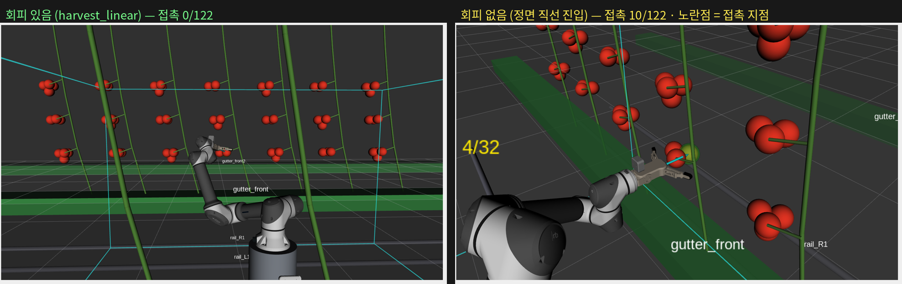

# 회피 알고리즘 있음 / 없음 — 스탠드 구성에서 토마토 접근 비교

> 2026-08-21 · 사용자 요청("스탠드를 포함한 로봇이 토마토에 접근할 때, 회피 알고리즘이 있는 것과
> 없는 매니퓰레이션 동작을 비교한 시뮬레이션").
> 수치 규칙 = `보고서-자료/작성지침.md` 3장(값·출처·재현 명령). 원자료 = `보고서-자료/원자료/회피비교-bench.{json,csv}`.
> 🔴 **이 문서의 결론은 같은 날 오후에 뒤집혔다** — 최신 결과·해석은 **`구성프리셋-선정규칙.md` 4장**
> (요약은 `보고서-자료/근거대장.md` 10장). 여기 수치는 **직선을 standoff 12cm 에서만 시작한 조건**의
> 것이고, 보고서에는 *조건이 결론을 바꾼 사례* 로만 인용한다. 4장 머리의 정정도 함께 볼 것.
>
> 🔴 **정본 불변** — `mounts.yaml`(md5 `7e0136f5…`)·`obstacles.yaml` 은 손대지 않았다.
> ⚠ 이때 적어 둔 `obstacles.yaml` **파일** md5 `58d65cae…` 는 **2026-08-21 저녁 교정 이후 어긋난다**
>   (`@tune` 마커·중립 기본값을 넣어 파일 바이트가 바뀌었다 → 현재 `19892537…`).
>   **불변을 보증하는 값은 파일 해시가 아니라 전개 해시**다 — 정본 장면 **187개 · md5 `c56c81b6…`**
>   가 교정 전후 동일하다(재현 = `근거대장.md` 11-3).
> 스탠드·현실 화방높이는 **별도 파일**로만 존재한다(3장).

---

## 1. 무엇을 비교했나 — "회피"가 하는 일을 세 가지로 갈랐다

수확 접근에서 회피 알고리즘이 실제로 하는 일은 세 가지다. 대조군은 그 세 가지를 **모두 뺀** 것이다.

| | 접근 방향 | IK | 경로 |
|---|---|---|---|
| **회피 있음** `harvest_linear` | 후보격자(φ×θ×ψ)를 훑어 **줄기를 피해 곧게 들어갈 수 있는 각**을 고름 | pre-grasp·grasp **둘 다 충돌 통과**해야 채택 | 자유공간 OMPL(RRTConnect) + 충돌검사 Cartesian 직선 |
| **회피 없음(정면)** `frontal` | **행잉베드 법선 고정**(φ=θ=0) — 탐색 없음 | `avoid_collisions=False` | 충돌검사 없는 Cartesian 직선 + 관절보간 왕복 |
| **회피 없음(보간)** `naive` | 목표 자세는 회피 쪽이 찾은 것을 **그대로 받음**(대조군에 유리) | — | home↔grasp **관절 직선보간**만 |

`frontal` 이 사용자가 말한 *"정면에서 직선으로 진입하는 형태"* 다.
`naive` 는 더 극단적인 하한(산업용 MoveJ)으로 함께 잰다.

🔴 **정면 = 행잉베드(재배 행) 면에 수직인 수평 방향**이다. 'base→열매 방향'이 아니다 —
로봇이 행 앞에 정확히 서 있을 때만 같고, 이 장면에서는 **12.7° 어긋났다**. 행은
`obstacles.yaml crops.rows` 가 `x` 로 정의하므로(행은 Y 로 뻗는다) 법선은 ±X 이고,
통로(로봇) 쪽에서 작물 쪽으로 부호를 정한다.

## 2. 구성 — 스탠드 + 현실 화방 높이

- 팔 베이스 **+500mm 스탠드**(`mounts_stand.yaml`) · 전용 SRDF `rda_robot_stand.srdf`
- 화방 높이 **현실값 `first_z=0.35`**(`obstacles_real_truss.yaml`) — 정본은 0.10 으로 낮춰 둔 값이다.
  🔴 **기본 구성 + 현실 높이는 도달 열매 0/74** 이므로 이 비교 자체가 스탠드에서만 성립한다
  (`도달권-스탠드-시험.md` 3장). **스탠드는 2026-08-18 에 채택하지 않기로 결정된 시험 구성**이다.
- 장면 = 설계값(Gazebo 없이 `obstacles.yaml` 직접) · 열매는 충돌객체 아님(`publish_targets:=false`)

## 3. 판정 기준 — 두 조건을 **같은 자로** 잰다

- **안전 기준** = 전 작물이 장애물 · 수확 대상 화방대만 허용 · 구 영역(계획용 완화) 제거.
  계획 때 쓴 완화가 남아 있으면 조건이 흐려지고, 반대로 목표 화방대까지 장애물로 두면
  *막 딴 열매가 제 화방대에 닿는 것*을 충돌로 센다(실측: 그 쌍 하나가 표시의 대부분을 차지했다).
- **검사 해상도 = 관절 0.02 rad** 로 양쪽을 세분해서 검사한다(`verify_max_step`).
  🔴 **이게 결과를 바꾼다** — 플래너 웨이포인트는 44~69점, 보간은 40점이라 그대로 세면
  밀도가 달라 비교가 안 되고, **성긴 표본은 얇은 줄기 사이를 그냥 지나친다**.
  같은 궤적을 성긴 검사로도 함께 재서(`bad_coarse`) 차이가 궤적 탓인지 해상도 탓인지 가른다.

> 🔴 **2026-08-21 오후 정정 — 이 장의 결론은 뒤집혔다.**
> 사용자 정정으로 "회피 없음" 을 **거터 법선 · 캐노피 밖에서부터 직선 진입**으로 다시
> 정의해 재측정하니 `frontal` 의 접촉이 **0/38(0.00%)** 이 됐다. 아래 수치는 직선을
> standoff 12cm 에서만 시작하고 그 앞을 관절보간으로 간 조건의 것이고,
> **접촉은 거의 전부 그 관절보간 구간에서 났다.**
> ⇒ 최신 결과·해석은 **`구성프리셋-선정규칙.md` 4장**을 볼 것. 이 장은 이력으로 남긴다.

## 4. 결과 (표본 6열매 × 반복 3 = 18런/전략) ※ 옛 정의 — 위 정정 참조

```bash
ros2 launch rda_robot_moveit_config pregrasp_demo.launch.py \
  mounts_file:=$PWD/src/rda_robot_description/config/mounts_stand.yaml \
  srdf_file:=$PWD/src/rda_robot_moveit_config/config/rda_robot_stand.srdf \
  obstacles_file:=$PWD/src/rda_robot_description/config/obstacles_real_truss.yaml \
  bench_strategy:=true bench_strategies:=harvest_linear,frontal,naive \
  bench_planners:=RRTConnect bench_n:=6 bench_repeat:=3 ik_timeout:=0.5 rviz:=false
```

| 전략 | 접촉이 난 런 | 접촉 웨이포인트 | 관절 경로 | 계획 시간 |
|---|---|---|---|---|
| **회피 있음** `harvest_linear` | **1 / 18** | **2 / 3685 = 0.05 %** | 5.68 rad | 1.97 s |
| **회피 없음 · 정면 직선** `frontal` | **8 / 18** | **96 / 5322 = 1.80 %** | 8.04 rad | 0.40 s |
| **회피 없음 · 관절보간** `naive` | **17 / 18** | **266 / 4830 = 5.51 %** | 6.89 rad | 0.36 s |

- 접촉 상대는 대부분 **주 줄기**(`stem_r0_p3_s1`, `stem_r0_p3_s0`)와 **이웃 화방대**(`rachis_r0_p2_t1`),
  그리고 **손에 든 열매**(`grasped_fruit_*`)다. 즉 회피가 없으면 손가락이 줄기를 밀고 지나가거나
  **딴 열매를 줄기에 끌고 나온다**.
- 정면 직선이 관절 경로가 **가장 길다**(8.04 rad) — 정면 자세를 만들려고 팔이 크게 돈다.
  회피가 있는 쪽이 경로도 짧다(5.68 rad).
- 계획 시간은 회피가 **5배 느리다**(1.97s vs 0.40s). 이게 회피의 값이다.

**열매별**(값 = 접촉 웨이포인트, 3회 반복):

| 열매 | 회피 있음 | 정면 직선 | 관절보간 |
|---|---|---|---|
| `fruit_r0_p3_t0_f0` | 0,0,0 | 0,0,0 | 32,0,34 |
| `fruit_r0_p2_t0_f0` | 0,0,0 | 0,0,0 | 6,6,8 |
| `fruit_r0_p2_t0_f3` | 0,0,0 | **8,0,8** | 22,14,22 |
| `fruit_r0_p2_t0_f2` | 0,0,0 | 0,0,0 | 16,6,16 |
| `fruit_r0_p3_t0_f2` | 0,**2**,0 | **2,2,2** | 2,26,2 |
| `fruit_r0_p3_t0_f1` | 0,0,0 | **34,6,34** | 6,46,2 |

⚠ **정면 직선이 항상 부딪히는 것은 아니다** — 앞이 트인 열매(4/6)는 정면으로도 닿는다.
회피의 값은 *평균*이 아니라 **막힌 열매에서도 성립하게 만드는 것**이다.

## 5. 화면 비교



- 왼쪽 = 회피 있음. 접근각을 φ·θ 로 틀어 줄기 사이로 들어간다. 접촉 **0/122**.
- 오른쪽 = 회피 없음(정면 직선). 행 법선으로 곧장 들어가 **주 줄기에 걸린다**. 접촉 **10/122**.
  **노란 점 = 접촉 지점**(사이클 동안 누적 표시). ⚠ 열매가 빨강이라 마커를 빨강으로 두면
  화면에서 구분이 안 된다 — 노랑으로 바꾼 뒤에야 보였다.
- 애니메이션: `images/회피비교_있음.gif` · `images/회피비교_없음.gif`

```bash
# 화면으로 직접 보기 (같은 열매를 두 전략으로)
ros2 launch rda_robot_moveit_config pregrasp_demo.launch.py \
  mounts_file:=$PWD/src/rda_robot_description/config/mounts_stand.yaml \
  srdf_file:=$PWD/src/rda_robot_moveit_config/config/rda_robot_stand.srdf \
  obstacles_file:=$PWD/src/rda_robot_description/config/obstacles_real_truss.yaml \
  rviz_config:=avoid_compare.rviz show_collisions:=true \
  target_name:=fruit_r0_p3_t0_f1 strategy:=harvest_linear   # ← frontal 로 바꿔 대조
```

🔴 **재생 모드에는 물리가 없다.** 회피 없는 궤적이 줄기를 관통해도 화면에서는 아무 일도
일어나지 않는다 — `show_collisions` 가 매 순간 planning scene 에 충돌을 조회해 접촉점을
찍어 주는 것이 두 동작을 가르는 **유일한 표시**다.

## 6. 곁에서 잡힌 것 — 파지 기하가 틀려 있었다 (사용자 지적)

비교 화면을 보던 사용자가 "집게가 잡는 부분이 구(열매) 중심 깊이에 와야 한다"고 지적했고,
mesh 를 재 보니 **종전 파지 거리는 열매를 손바닥에 박아 넣는 값**이었다.

RG2 실측(tcp 기준, 접근축 투영):

| 부위 | 깊이 |
|---|---|
| 손(palm, `rg2_hand`) | 0 ~ **12.72 cm** |
| 손가락 전체 | 9.07 ~ 21.25 cm |
| 파지면(맞은편을 향한 면) | 9.89 ~ 21.24 cm · 32삼각형 · 27.3 cm² |
| **손 앞으로 나온 구간의 파지면 면적중심** | **15.82 cm** |

- 종전 `grasp_depth=0.33` → 파지거리 **13.1 cm** ⇒ 열매(r 3.5cm) 앞면이 **9.6 cm**
  = 손가락 뿌리의 두꺼운 **구동부(9.9~11.3cm)** 에 박힌다.
- 파지면 중심만 맞추면(15.23cm) 이번엔 **손바닥 앞면 12.72cm 가 열매 앞면 11.73cm 를 1.0cm 파고든다**.
- ⇒ **손바닥 여유를 하한으로 걸어야 한다**: `goff ≥ palm_front + r + 여유(5mm)` = **16.72 cm**.
  결과: 손바닥 여유 **+0.50cm** · 손끝 여유 **+1.04cm** — 열매가 노출된 집게 안에 대칭으로 들어온다.
  종전보다 **3.6cm 덜 접근**한다.

구현 = `robot_introspect.gripper_pad_center()` 신설 + `grasp_depth` 기본값 **-1(auto)**.
비율(0~1)로 두면 그리퍼가 바뀔 때 같은 값이 다른 곳을 뜻하므로, **URDF mesh 에서 유도**한다.

⚠ 종전 주석은 *"깊게 물수록 손끝이 열매 뒤로 더 들어간다"* 고 적고 있었으나 **반대다** —
`goff` 가 커지면 TCP 가 물러서므로 캐노피 침투는 오히려 준다.
⚠ 다만 **센싱(옥토맵) 장면에서 깊은 값으로 파지 자세가 안 나온 실측**(수확 1→0)이 있다.
인지 장면에 적용할 때는 그 실측을 다시 확인할 것.

## 7. 보증하지 않는 것

- **실기 미검증** — 전부 시뮬레이션(설계값 장면)이다. 접촉은 planning scene 판정이지 실제 접촉력이 아니다.
- **스탠드는 채택되지 않은 구성**(2026-08-18 결정). 이 비교는 "현실 화방 높이에서 도달이 되는 구성"을
  만들기 위한 것이고, 기본 구성에서는 현실 높이 도달 열매가 0개라 같은 비교를 할 수 없다.
- **회피가 접촉 0 을 보증하지 않는다** — 18런 중 1런에서 2점 스침이 남았다(`rg2_leftfinger|rachis_r0_p3_t1`).
  원인 미규명 = **검증 부채**.
- 접촉 수는 **검사 해상도에 따라 달라진다**(0.02 rad 기준). 절대값이 아니라 **같은 자로 잰 상대값**으로 읽을 것.
- 열매는 기본적으로 충돌객체가 아니다(`publish_targets:=false`) — 이웃 열매와의 접촉은 세지 않았다.
